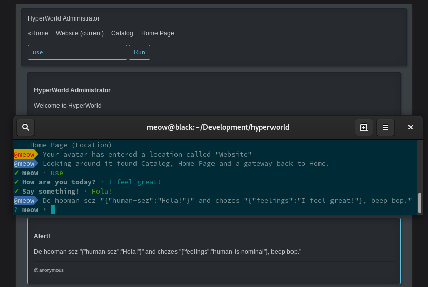
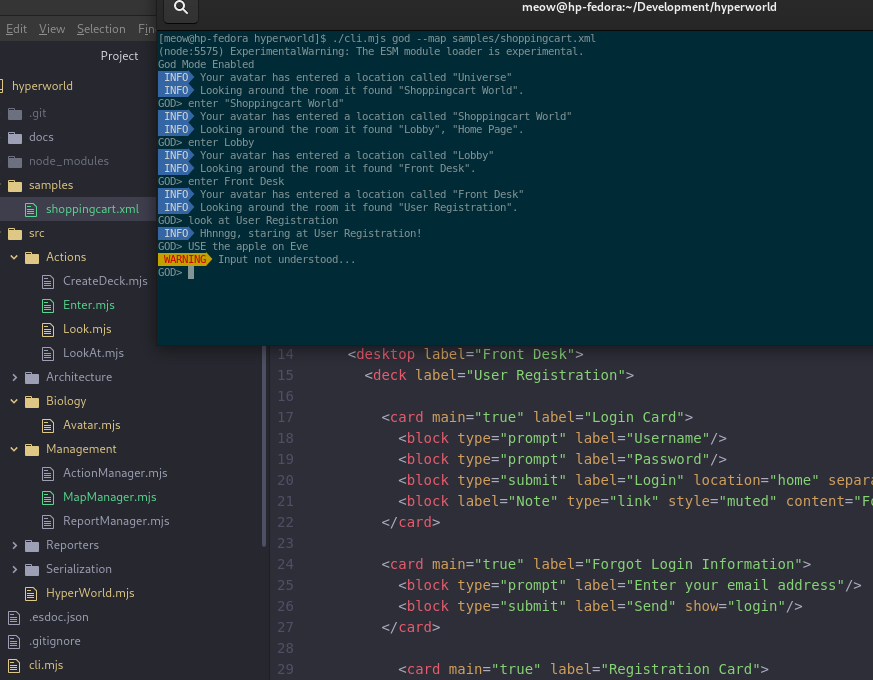
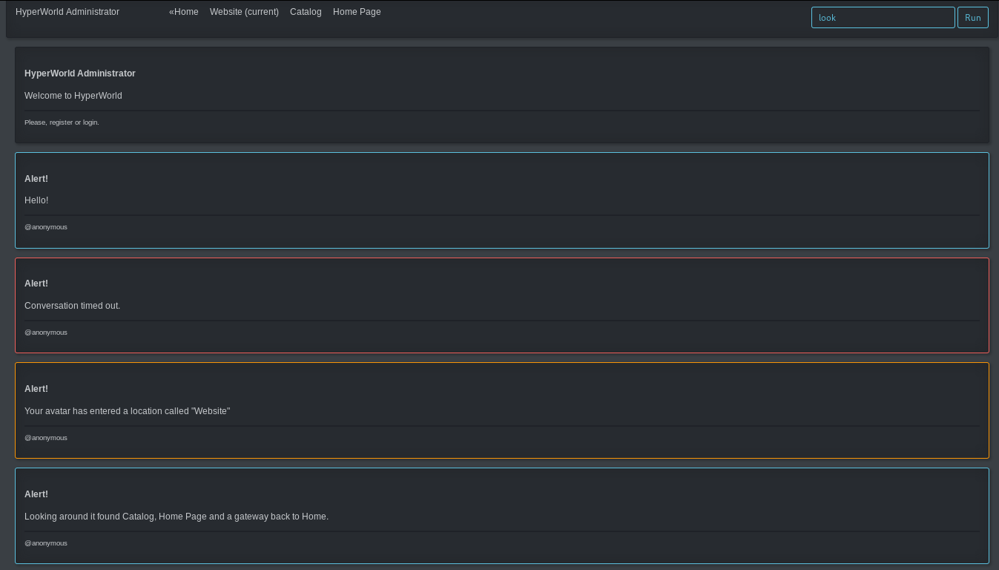
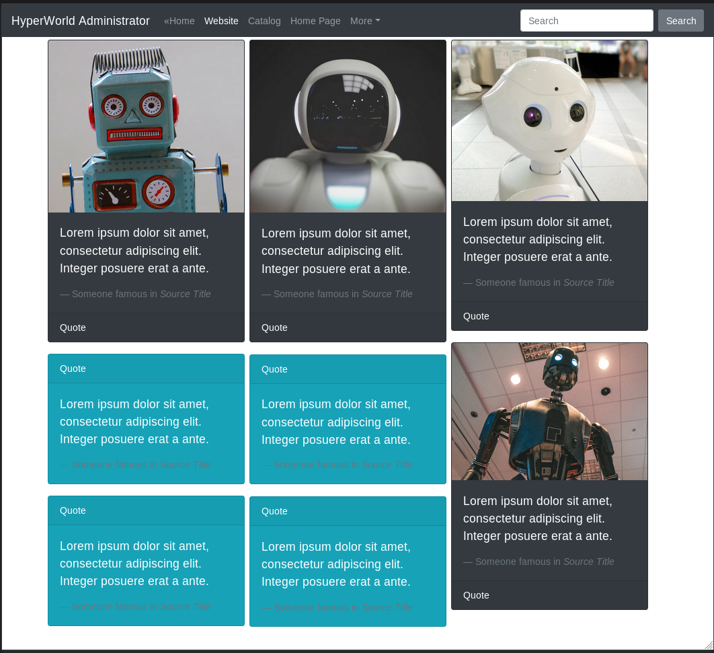
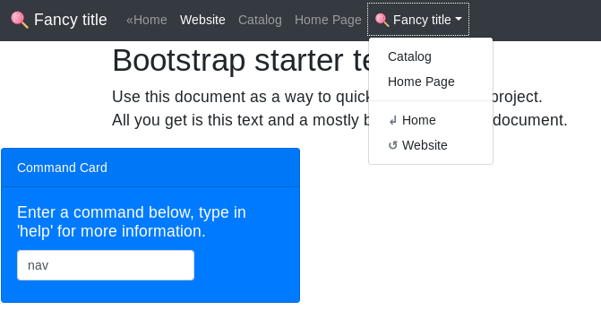
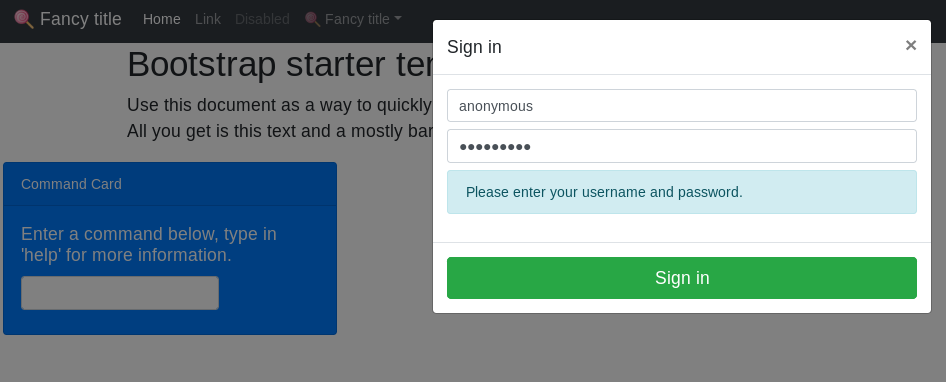
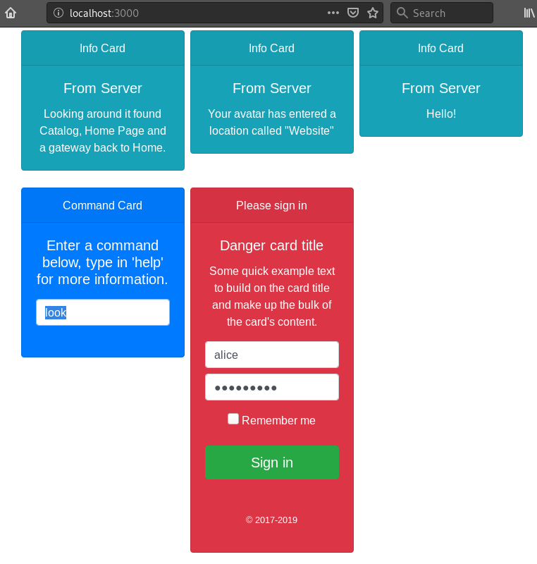
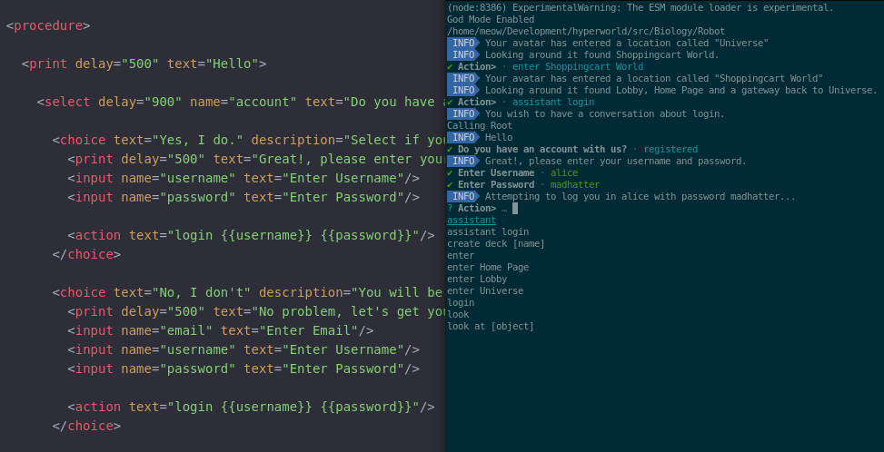
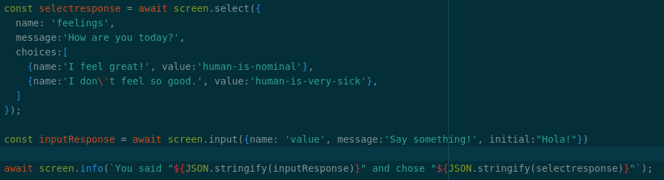

# HyperWorld OOP Language
Virtual World of Objects.

I write this program in hopes of creating a general purpose orchestration language for my friends and you.
Programming is hard, but you don't need to learn programming to be a programmer. You just need to learn writing
things in such a way that a programmer can come in and fill in the code you need.

Before we begin please visit [MUD on Wikipedia](https://en.wikipedia.org/wiki/MUD) to get a better idea where we are headed and how we are going to get there. Here, are some of the more notable YouTube videos on the subject.
- [The MUD, or Multi User Dungeon](https://www.youtube.com/watch?v=4C7THj0VZcI)
- [GET LAMP: The Text Adventure Documentary](https://www.youtube.com/watch?v=LRhbcDzbGSU)
- [Search YouTube for MUD](https://www.youtube.com/results?search_query=multi+user+dungeon)

## Program Architecture

Program Interfaces / Clients
- [Web Server](server.mjs)
- [Command Line](cli.mjs)
- [Module Import](index.mjs)

Web Client

- [Entry Point and Component Templates](public/index.html)
- [Program](public/index.js)
- [Shared Stylesheet](public/style.css)
- Web Components
  - [screen-component](public/modules/screen-component/index.js)
    - [alert-component](public/modules/alert-component/index.js)
    - [login-component](public/modules/login-component/index.js)
    - AI Interface
      - [input-component](public/modules/input-component/index.js)
      - [select-component](public/modules/select-component/index.js)
  - [navigation-container](public/modules/navigation-container/index.js)
    - [links-component](public/modules/links-component/index.js)
    - [command-component](public/modules/command-component/index.js)


Class Structure

- [Root](src/organization/index.mjs) - central access point
  - .login(username, password)
  - .session(?) - user session
  - [Universe](src/organization/node_modules/Universe/index.mjs)
    - .location(name) - finds a location by name (interface to map)
    - .show() - displays a map of the universe (interface to map)
    - [Map](src/organization/node_modules/Map/index.mjs) - loads and holds the universe map (xml)
  - [Commands](src/organization/node_modules/Commands/index.mjs)
    - .input(text)
    - .completions()
  - [Session](src/organization/node_modules/Session/index.mjs)
    - [User](src/organization/node_modules/User/index.mjs)
      - [Avatar](src/organization/node_modules/Avatar/index.mjs)
      - .location - set get avatar location
      - command() - parse user input text
      - completions() - return a list of potential commands
      - [Screen](src/organization/node_modules/Screen/index.mjs)
        - .data(data) - You can send data
        - .info(text) - Info
        - .warning(text) - Warning
        - .danger(text) - Danger
        - .error(text) - Error
        - .input(data) - Ask for text input
        - .select(data) - Ask to select something
        - .prompt(data) - print a prompt, especially in a terminal
        - [JSON (Web)](src/organization/node_modules/Screen/Printer/Json.mjs) - Interface via Web
        - [Enquirer (Terminal)](src/organization/node_modules/Screen/Printer/Enquirer.mjs) - Interface via Terminal

## GUI Screenshots - The Universal Interface

The user interface is abstracted via [Screen Object](src/organization/node_modules/Screen/index.mjs)
no extra steps are required to craft terminal or web interface.



## Development Screenshots








## World Structure
- Universe is made up of Locations
- Location contain interactive Agents/Robots


## Processing Humans - a simple approach to AI

When a robot asks a question, the question is paired with pre-set anwsers:
For example: "How are you?: [Great!]/[Awful]", or "Do you want to schedule an appointment?: [Yes]/[No]"


## Interactive Components and the USE command

A world needs to engage the user, a robot may ask "How are you?: [Great!]/[Awful]", or "Do you want to schedule an appointment?: [Yes]/[No]"
(note that questions are coupled with pre-set answers to sidestep parsing)

A music player may print "Which song do you want to play? [Hey There]/[The Hork Song]" these are the fundamental OBJECTS in HyperWorld small
stateful finite XML node driven state machines. Beyond that it is just Locations and Locations within Locations ad Infinitum.

Primary mode of interacting with State Machines is the use command.
For example to log into the system the user will state:

    use login machine

To tweet from within the system the user can:

    use twitter send 'I hate this.'

## Press
- Project name is: HyperWorld (One word, both Hyper and World are capitalized)
- [NPM Package](https://www.npmjs.com/package/hyperworld)
- [GitHub Repository](https://github.com/fantasyui-com/hyperworld)


## Developer Notes

(developer note: use Atom's markdown preview plus plugin to navigate links below)

## Todo

- Authentication
- do not use shorthand ```<tag/>``` use the full <tag></tag> markup.
- research z-circle-ui
- robotiq state machine components
- Web Components feel fickle, need a debug tool.

### State Machine Components (was known as Robot)

- Here is the state machine front-end: [Commands/Machine](src/organization/node_modules/Commands/node_modules/Machine/index.mjs)
- State machine UI is driven by [JSON Screen Printer](src/organization/node_modules/Screen/Printer/Json.mjs)
- Decide what to do when a component Promise expires in [JSON Screen Printer](src/organization/node_modules/Screen/Printer/Json.mjs)'s Input and Select. Note: the try/catch is located in the [Commands/Machine](src/organization/node_modules/Commands/node_modules/Machine/index.mjs)
- FINISH: [Select Component](public/modules/select-component/index.js)
- Initialize Robots - Robots are the Primary way of Interacting with System
  - while the system is operational it should really be run by a subsystem
    that employs XML to create the State Machine Tree Structure.
- upgrade the ```USE``` command
- REVIEW: [Input Component](public/modules/input-component/index.js)
