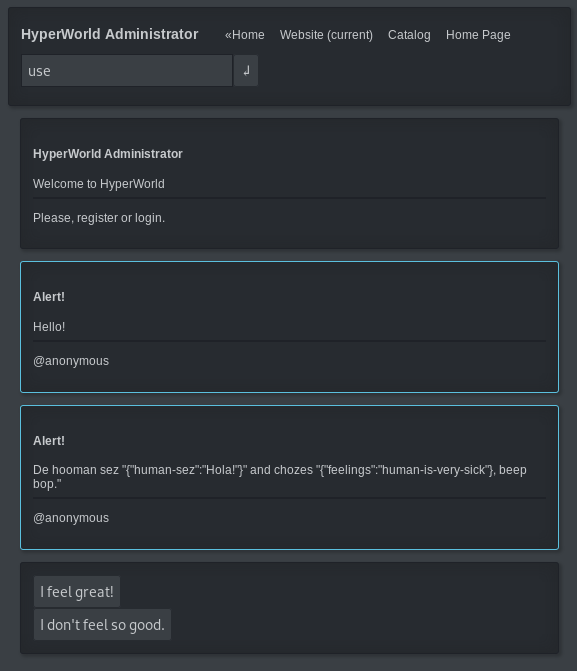
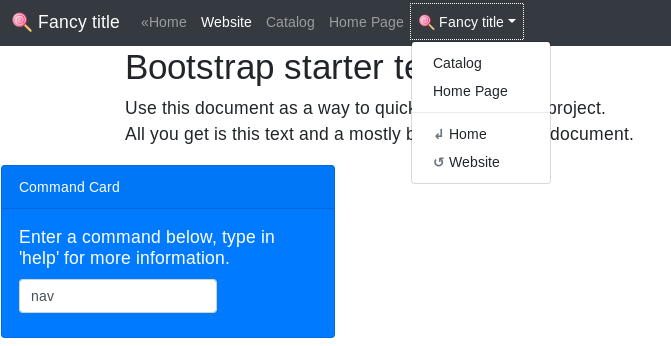
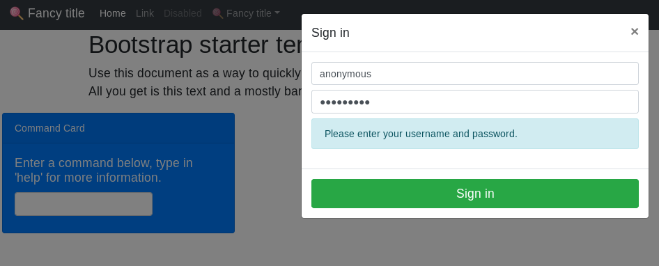
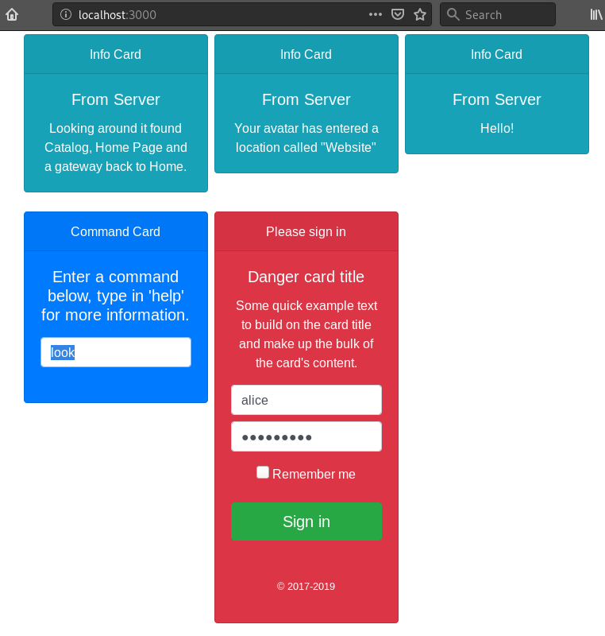
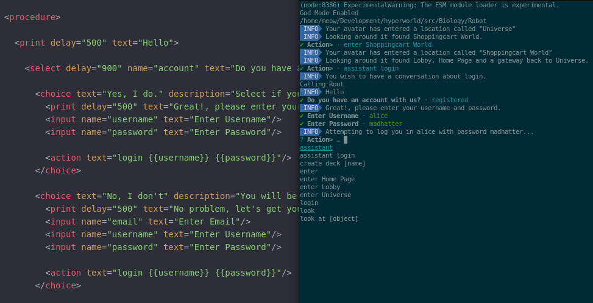

# HyperWorld OOP Language
Virtual World of Objects.








## World Structure
- Universe is made up of Locations

## Developer Notes
- Custom Element's Sub Elements must be registered AFTER the Main Custom Element calls customElements.define(...);

## Todo
- Insert a command processor where the search box is
- Initialize Robots - Robots are the Primary way of Interacting with System

## Press
- Project name is: HyperWorld (One word, both Hyper and World are capitalized)
- NPM Location: https://www.npmjs.com/package/hyperworld
- GitHub Location: https://github.com/fantasyui-com/hyperworld#readme

## Administration
- Define Components before defining sub Components
- do not use shorthand ```<tag/>``` use the full thing.

## Notes

- robotiq
- <script src="https://unpkg.com/lit-html/lit-html.js"></script>
- z circle ui
